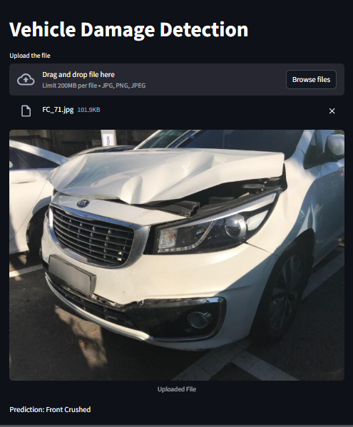

# Vehicle Damage Detection App

This app lets you drag and drop an image of a car and its will tell you
what kind of damage it has. The model is trained on third quarter front and rare view.
Hence the picture should capture the third quarter front or rare view of a car.




### Model Details
1. Used ResNet50 for transfer learning
2. Model was trained on around 1700 images with 6 target classes
   1. Front Normal
   1. Front Crushed
   1. Front Breakage
   1. Rear Normal
   1. Rear Crushed
   1. Rear Breakage
3. The accuracy on the validation set was around 80%


### Set Up

1. To get started, first install the dependancies using:
   ``` commandline
   pip install -r requirements.txt
   
2. Run the streamlit app:
   ``` commandline
   streamlit run app.py
